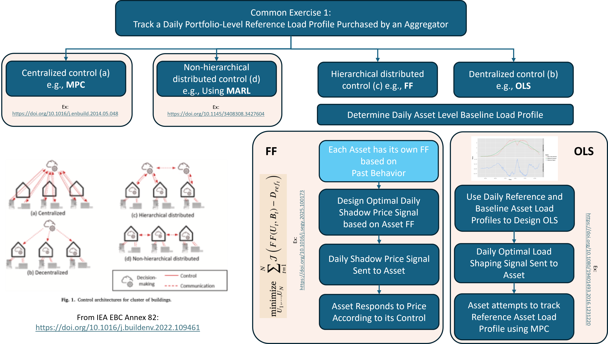

# IEA EBC Annex 96: Common Exercise 1

## Instructions (December 12, 2025)

---

## Table of Contents
- [Objective](#objective)
- [Instructions](#instructions)
- [CityLearn Tutorial](#citylearn-tutorial)
- [Suggested Timeline](#suggested-timeline)
- [Evaluation Metrics](#evaluation-metrics)
  - [Reference Load Profile](#reference-load-profile)
  - [Primary Metrics](#primary-metrics)
  - [Secondary Metrics](#secondary-metrics)

---

## Objective

The purpose of **Common Exercise 1** is to bring together all participating Annex 96 research groups in a joint challenge using a **shared toolchain (CityLearn)**.  
Although flexible demand can support many grid services, the first exercise focuses on a single scenario:

> **A portfolio of buildings must track a daily portfolio-level reference load profile purchased by an aggregator.**

This allows for consistent comparison across different control strategies and architectures.



---

## Instructions

1. **Scope**  
   The exercise focuses on grid-interactive efficient buildings with:  
   - electrically driven **space heating** or **space cooling**,
   - **on-site solar PV**,  
   - **battery electric storage (BES)**.

2. **Select a Climate / Building Portfolio**  
   Choose **one** of the two provided building portfolios (both from the ResStock dataset) found in data/datasets/annex96_ce1_{state}_neighborhood:  
   - **Texas** ('TX': cooling-dominated)  
   - **Vermont** ('VT': heating-dominated)  
   You may experiment with both.

3. **Portfolio Description**  
   Each portfolio contains **25 single-family homes**, each pre-configured with PV + BES in CityLearn.  
   All participants use the same buildings for consistency.

4. **Degrees of Freedom (Control Actions)**  
   Controllers can manipulate:
   - **Battery charge/discharge**,  
   - **Heat pump operation** (thermal mass control).  
   PV **cannot** be exported to the grid.

5. **Primary Task**  
   Develop any control architecture—centralized, decentralized, hierarchical, distributed, RL, MPC, RBC, or hybrids—to track a **daily portfolio-level reference load profile**.

6. **Secondary Tasks**  
   Monitor and report building-level and portfolio-level metrics:  
   - operational cost  
   - emissions  
   - ramping  
   - other relevant metrics (signals provided)

7. **Training Period**  
   One month:  
   - **January** (Vermont, peak heating)  
   - **August** (Texas, peak cooling)  
   You may re-simulate the month repeatedly until convergence.

8. **Testing Period**  
   One month of unseen data following training:  
   - **February** for Vermont  
   - **September** for Texas  
   All performance metrics are evaluated on test results.

9. **Baseline Controller**  
   Baseline scenario assumes:
   - PV system **without** battery storage,  
   - thermostat **deadband** controller,  
   - PV self-consumption only (no export).  

---
## CityLearn Tutorial
See /notebooks/ce1_tutorial for a quickstart on how to use citylearn with a standard RBC.

---
## Suggested Timeline

- **Finalize Common Exercise + datasets**: December 12, 2025
- **Kickoff**: January 16, 2025
- **Submission Deadline**: April 15, 2025
- **Results comparison**: next Annex 96 meeting in Torino

---

## Evaluation Metrics

To ensure comparability across teams, the following metrics should be reported at a minimum.  
Simulations must include **all end uses** (HVAC, appliances, lighting, plug loads) to compute both **building-level** and **portfolio-level** metrics.

Metrics should be evaluated **daily** over the testing month, producing distributions or box plots where appropriate.


### Reference Load Profile

The main objective is to track the **aggregated load profile** of the building portfolio.

The reference profile for each day is defined as:

> **The daily average aggregated baseline load of the portfolio**,  
> resulting in a constant target value for that day.

**Example:**  
If daily total load = 2400 kWh:  
- reference power = 2400 kWh / 24 h = **100 kW**  
- reference 15-minute energy = 2400 kWh / 96 intervals = **25 kWh / interval**

This becomes the target profile for the entire day.


## Primary Metrics

### Portfolio-Level Reference Load Tracking

#### 1. Normalized Mean Bias Error (NMBE) [%]  
Calculated as the mean of the differences between the actual aggregated portfolio load and the reference load profile for each time interval, normalized by the mean reference load and expressed as a percentage. This metric indicates systematic over- or under-consumption relative to the target.

$$
\text{NMBE} = \frac{\text{mean}(y - y_{\text{ref}})}{\text{mean}(y_{\text{ref}})} \times 100\%
$$


#### 2. Coefficient of Variation of RMSE (CV-RMSE) [%]  
Calculated as the root mean square error between actual aggregated portfolio load and reference load profile, normalized by the mean reference load. This metric captures the overall tracking accuracy including both bias and variance.

$$
\text{CV-RMSE} =
\frac{\sqrt{\text{mean}((y - y_{\text{ref}})^2)}}{\text{mean}(y_{\text{ref}})} \times 100\%
$$

### Thermal Comfort

#### Temperature Exceedance Hours (hours)  
The cumulative hours during which indoor air temperature falls outside the comfort bounds:

- **Heating season:** 20–24 °C  
- **Cooling season:** 22–26 °C  

Report:  
- total exceedance hours per building  
- percent of hours exceeded across portfolio


## Secondary Metrics

### Fairness
This metric documents the diversity in individual response when tracking the portfolio signal, i.e. the activation of individual flexible assets per consumer, and whether this is proportional on a portfolio level. A few individual consumers providing most of the flexibility in the portfolio repeatedly is undesirable in terms of flexible response reliability, device longevity as well as the potential impact on occupant comfort.


### Cost Changes [%]
Cost changes is the relative savings between the baseline PI controller without energy flexibility activation and the corresponding energy flexible operation given the control strategy utilized.

### Carbon Emissions [kg CO₂e]
Total operational carbon emissions based on provided hourly grid carbon content. 

### Change in Site Total Energy Consumption [%]
Total site energy consumption percentage difference between the baseline scenario or simple RBC controller without energy flexibility activation and the scenario with energy flexibility activation gives an indication of the “energy efficiency” of energy flexibility. This metric serves to show how flexibility activation changes total portfolio site energy consumption.

### Peak Demand [kW]
Peak demand is the maximum electricity demand in kilowatts, measured from simulation time series results. Peak demand determines the maximum generation requirements in serving the building portfolio. To better characterize the portfolio demand, base case peak demand and energy flexible peak demand should be reported separately. In addition to the values of the peak demand, the time of its occurrence should be recorded. For example, baseline: Peak demand of 100 kW occurring at 8:00 AM on Feb 2; flexibility-aware portfolio: peak demand of 120 kW occurring at 5:45 AM on Feb 15.

### Peak-to-Valley Ratio [%]
Ratio of the daily peak demand to the daily minimum demand and is calculated considering the hourly demand values. Peak to valley ratio gives a measure for the amount of generation that must be brought online to satisfy demand. A value of one indicates a constant load. This metric gives a sense for the magnitude of the dispatchable generation required to meet demand. Record for both baseline and energy flexible operation, resulting in ~30 values for the analysis month.

$$
\text{PVR} = \frac{\text{daily peak}}{\text{daily minimum}}
$$

### Load Factor [%]
Ratio of the average daily demand over the peak daily demand. Load factor indicates how well the generation assets in the system are utilized. Load factors approaching unity indicate a nearly constant use of the assets. The metric is calculated using the hourly demand values consistent with other metrics. Record for both baseline and energy flexible operation, resulting in ~30 values for each analysis month. A higher load factor indicates better utilization of generation assets.

$$
\text{load factor} = \frac{\text{average electricity demand}}{\text{maximum daily electricity demand}}
$$

### System Ramping [kW]
Measure of the total absolute daily change in portfolio electricity demand from one hourly interval to another.  The metric is calculated using the hourly demand values consistent with other metrics. This metric indicates how much demand changes in total over the course of a day. Calculate the absolute value of the change from one hourly period to another over the course of each day (24 total values/day) and then sum all 24 values for each day to calculate the daily value.  Record for both baseline and energy flexible operation, resulting in ~30 daily values for the testing month.

$$
\text{ramping} = \sum_{i=1}^{24} \left| y_i - y_{i-1} \right|
$$


----------------------------------------------------------------


# CityLearn
CityLearn is an open source Farama Foundation Gymnasium environment for the implementation of Multi-Agent Reinforcement Learning (RL) for building energy coordination and demand response in cities. A major challenge for RL in demand response is the ability to compare algorithm performance. Thus, CityLearn facilitates and standardizes the evaluation of RL agents such that different algorithms can be easily compared with each other.


## Environment Overview

CityLearn includes energy models of buildings and distributed energy resources (DER) including air-to-water heat pumps, electric heaters and batteries. A collection of building energy models makes up a virtual district (a.k.a neighborhood or community). In each building, space cooling, space heating and domestic hot water end-use loads may be independently satisfied through air-to-water heat pumps. Alternatively, space heating and domestic hot water loads can be satisfied through electric heaters.


## Installation
Install latest release in PyPi with `pip`:
```console
pip install CityLearn
```

## Documentation
Refer to the [docs](https://intelligent-environments-lab.github.io/CityLearn/).

## CityLearn UI

CityLearn UI is a visual dashboard for exploring simulation data generated by the CityLearn framework. It was developed to simplify the analysis of results from smart energy communities, district energy coordination, demand response (among other applications), allowing users to visually inspect building-level components, compare simulation KPIs, and create simulation schemas with ease.

The interface is available in two options:

* Web app: https://citylearnui.netlify.app/ (free hosted version — not recommended for sensitive/personal data)
* Open-source code: https://github.com/Soft-CPS-Research-Group/citylearn-ui

You can check a tutorial at the official CityLearn [website](https://intelligent-environments-lab.github.io/CityLearn/ui.html), in the CityLearn UI repository [README](https://github.com/Soft-CPS-Research-Group/citylearn-ui), or at the help [tooltip of the oficial webapp](https://citylearn-ui.netlify.app/admin/help).

**Compatibility:** This version of the UI currently supports CityLearn v2.5.0 simulation data.

**Developed by:** José, a member of the [SoftCPS](https://www2.isep.ipp.pt/softcps/), Software for Cyber-Physical Systems research group (ISEP, Portugal) in collaboration with the Intelligent Environments Lab, University of Texas at Austin.

# End of README
